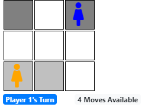
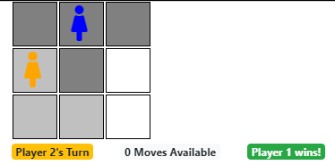

Isolation
=========

An AI browser-based game, where the goal is to be the last player with an available move.

[Play Online](https://codepen.io/primaryobjects/full/QWWGgmR)

Isolation offers a simple environment to demonstrate the artificial intelligence AI algorithm [Minimax](https://en.wikipedia.org/wiki/Minimax) with [Alpha-beta pruning](https://en.wikipedia.org/wiki/Alpha%E2%80%93beta_pruning).





## How to Play

At each turn, the player may choose to move any number of spaces up, right, down, left, or diagonally as long as the path is not blocked by a previously visited cell.

After the first player selects a cell to start, the second player may choose a starting cell. Players then take turns moving their player to a new cell, according to the rules above, until a player can no longer make a move - meaning that the player is effectively trapped. At this point, the opposing player wins.

One of the simplest implementations of the game is a 3x3 grid.

## AI Opponent Using Minimax

The AI computer player uses the Minimax algorithm. This allows the AI to take the current game board state and build a tree of all possible moves and next states that each player may take. The Minimax algorithm is then applied from the bottom of the tree, upwards, in order to determine the best move to make for the current turn. The AI always assumes that the player will make an optimal move, and bases its decision accordingly.

Isolation implements a port of the Minimax with Alpha-beta pruning algorithm developed for [Python](https://tonypoer.io/2016/10/28/implementing-minimax-and-alpha-beta-pruning-using-python/).

## Running the Game

[Play Online](https://codepen.io/primaryobjects/full/QWWGgmR)

Or run locally, with the following command.

```bash
cd isolation
python -m SimpleHTTPServer 8000
```

Any http server may be used to host the game locally. An example of using the Python SimpleHTTPServer is shown above. Execute the above command from the directory containing the game. Then navigate to http://localhost:8000 to play the game.

## How is it Made?

Isolation is developed with Javascript, React, Twitter Bootstrap.

## License

MIT

## Author

Kory Becker
http://www.primaryobjects.com/kory-becker
